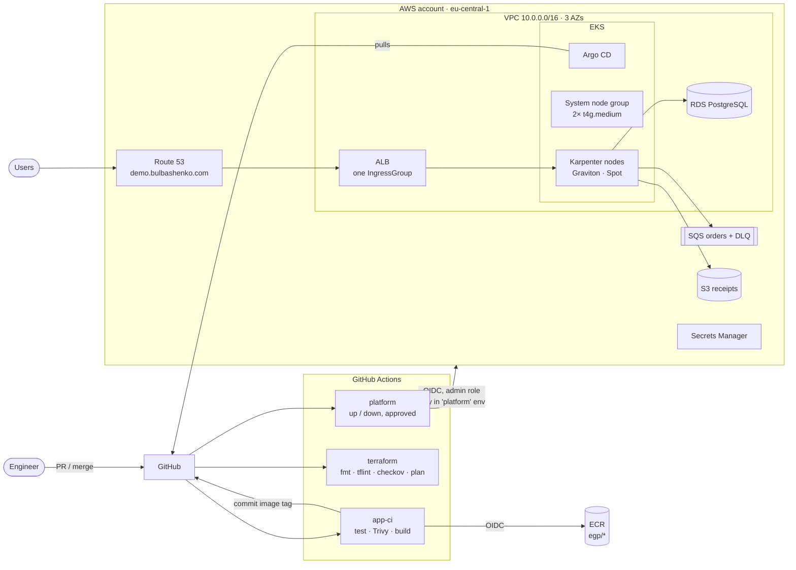
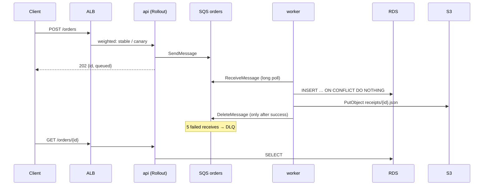
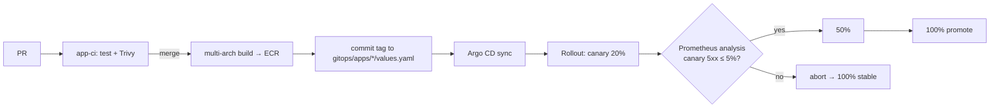

# Architecture

This document explains how the platform fits together and why. Each significant decision has an ADR in [adr/](adr/).

## Goals and constraints

| Goal | How it shows up |
|---|---|
| Production-shaped, not a toy | Private subnets, IAM-only cluster auth, OIDC CI, least-privilege Pod Identity, admission policies, SLOs |
| Everything as code | Terraform for AWS, Argo CD for everything inside the cluster. No `kubectl apply` or console clicks in the normal flow |
| Safe delivery | Canary releases gated by live error-rate analysis, with automatic rollback |
| Cheap to run | Ephemeral environment (~30 min up, one command down), Graviton + Spot, single NAT. About $0.30/h while up |

## High-level view



## Layers and state

Terraform is split into **independently applied root modules**, each with its own state file in S3 (encrypted with KMS, native S3 locking):

| Layer | Lifetime | Contents |
|---|---|---|
| `bootstrap` | once per account, local state | State bucket, KMS key |
| `00-foundation` | **persistent** | GitHub OIDC provider and CI roles, ECR, Route 53 zone, ACM wildcard certificate, budget alert |
| `10-network` | ephemeral | VPC, subnets (public / private / intra / database), NAT, S3 endpoint |
| `20-cluster` | ephemeral | EKS, system node group, Karpenter IAM + interruption queue, controller Pod Identity, Argo CD |
| `30-data` | ephemeral | RDS, SQS, S3, application Pod Identity |

Splitting the layers keeps blast radius and plan time small: a change to an SQS setting cannot touch the cluster. It also makes the persistent/ephemeral boundary explicit. Registries, DNS and the certificate survive `make down`, so `make up` needs no manual steps. Layers read each other through `terraform_remote_state` outputs only. See [ADR-0004](adr/0004-terraform-layering.md).

## Terraform → Argo CD handover (GitOps Bridge)

Terraform creates only Argo CD and one root Application. Every in-cluster component (controllers, policies, dashboards, the apps) is delivered by Argo CD from `gitops/`.

Helm values in Git often need facts that only Terraform knows: the cluster endpoint, the Karpenter queue, the SQS URL, the database host. Instead of committing those values or templating them in CI, Terraform writes them as **annotations on Argo CD's cluster Secret**. ApplicationSets use the cluster generator and template them into Helm values:

```
Terraform 20-cluster ─┐                        ┌─> ApplicationSet (cluster generator)
Terraform 30-data   ──┼─> Secret argocd/in-cluster ─┤     {{ index .metadata.annotations "orders_queue_url" }}
                      │   annotations + labels    └─> Helm valuesObject
```

Each layer owns its annotations through a separate server-side-apply field manager, so layers never overwrite each other. 30-data also sets the label `egp.io/data-layer=ready`. The apps ApplicationSet selects on that label, so services are only generated once their data services exist. Role ARNs never appear in Git: Pod Identity associations bind IAM roles to service-account names in Terraform. See [ADR-0005](adr/0005-gitops-argocd.md) and [ADR-0006](adr/0006-pod-identity.md).

## Network

| Subnet tier | Size | Route to internet | Used by |
|---|---|---|---|
| public | 3 × /24 | Internet gateway | ALB, NAT gateway |
| private | 3 × /20 | NAT | Nodes and pods (VPC CNI gives pods VPC IPs) |
| intra | 3 × /24 | none | EKS control-plane ENIs |
| database | 3 × /24 | none | RDS |

- **One NAT gateway** in the demo. The `single_nat_gateway` flag switches to one per AZ ([ADR-0003](adr/0003-single-nat.md)). S3 traffic, including ECR layer downloads, uses a free gateway endpoint instead of NAT.
- **VPC CNI prefix delegation** lets a t4g.medium run 58 pods instead of 17.
- **NetworkPolicy** is enforced by the VPC CNI's eBPF agent. App pods accept traffic only from `monitoring` (scrapes) and, for the api, from the VPC CIDR (the ALB).
- RDS accepts connections only from the node security group, and TLS is forced (`rds.force_ssl=1`).

## Compute

- **System node group**: 2 × t4g.medium, On-Demand, AL2023 ARM. Runs controllers only; Karpenter must not run on capacity it manages.
- **Karpenter NodePool**: arm64, Spot preferred with On-Demand fallback, c/m/r/t families, medium to xlarge. It consolidates empty or underutilised nodes after 1 minute and has a hard limit of 16 vCPU / 64 GiB.
- Application pods require `node-role.egp.io/workload=true`, so they always land on Karpenter capacity. That is what makes the scale-out demo visible.
- Nodes enforce IMDSv2 with hop limit 1, so pods cannot borrow the node role. AWS access goes only through Pod Identity.

See [ADR-0002](adr/0002-karpenter.md).

## Application



- Delivery is at least once, and processing is idempotent (primary key + `ON CONFLICT DO NOTHING`).
- `/readyz` fails as soon as SIGTERM arrives. Together with the preStop sleep and the ALB pod readiness gate, this gives zero-downtime rollouts.
- Credentials: External Secrets turns the RDS-managed master secret into `PG*` environment variables. The app never sees AWS Secrets Manager and has no IAM permission to read it.

## Delivery



CI never has cluster credentials. It records the desired version in Git, and Argo CD reconciles it. Argo Rollouts shifts traffic at the ALB with weighted target groups. The background analysis compares only the canary ReplicaSet's error ratio (PodMonitor carries the `rollouts-pod-template-hash`), so stable traffic cannot mask a bad canary. See [ADR-0008](adr/0008-progressive-delivery.md).

## Security summary

| Control | Implementation |
|---|---|
| No long-lived credentials | GitHub OIDC → three roles scoped by subject claim (main branch, PRs, protected environment) |
| Cluster access | EKS access entries (API mode), no aws-auth ConfigMap. Public endpoint is IAM-authenticated |
| Workload identity | EKS Pod Identity, one role per service, resource-scoped policies |
| Secrets | Generated by RDS / Terraform into Secrets Manager, synced by ESO. Nothing sensitive in Git or Helm values |
| Supply chain | Trivy gate in CI, immutable ECR tags, scan on push, SBOM + provenance attestations, actions pinned by SHA |
| Admission | Kyverno: no privileged pods, no `:latest`, app images only from own ECR, non-root / read-only / resource limits. PSA `restricted` on `orders` |
| Network | Private nodes, DB in isolated subnets, NetworkPolicies, TLS 1.3 policy on the ALB, UIs limited to an IP allowlist |
| Encryption | KMS for state, EKS secrets envelope encryption, encrypted RDS, EBS and ECR |
| IaC scanning | tflint + checkov in pre-commit and CI. Each skipped check has a written reason in `.checkov.yaml` or inline |

## Observability

- **Metrics**: kube-prometheus-stack. Services expose RED metrics, and PodMonitors add `app` and `rollout_hash` labels.
- **SLO**: 99% availability for the api, with multi-window multi-burn-rate alerts (14.4× over 5m/1h, 6× over 30m/6h).
- **Logs**: Alloy tails pod logs through the Kubernetes API into Loki (no host mounts). JSON `level` is promoted to a label.
- **AWS metrics**: Grafana's CloudWatch data source (Pod Identity) shows SQS depth, DLQ size and RDS CPU/connections.
- **Dashboard** "Orders — service overview" shows SLO, RED per version, the async pipeline, HPA/Karpenter capacity and error logs.

Nothing uses persistent volumes, because the environment lives for hours. See [ADR-0009](adr/0009-observability.md).

## What production would change

See [ADR-0011](adr/0011-ephemeral-environments.md) for the cost trade-offs. In short:
- one NAT per AZ, Multi-AZ RDS, 3 replicas for the Kyverno admission controller and Karpenter;
- a private EKS endpoint with self-hosted runners in the VPC, and a separate AWS account per environment under Organizations;
- an app-specific database role instead of the master user, with IAM database authentication;
- cosign signing verified by Kyverno, WAF on the ALB, GuardDuty and CloudTrail, SSO for Argo CD and Grafana;
- persistent storage (or Amazon Managed Prometheus) for metrics and logs.
